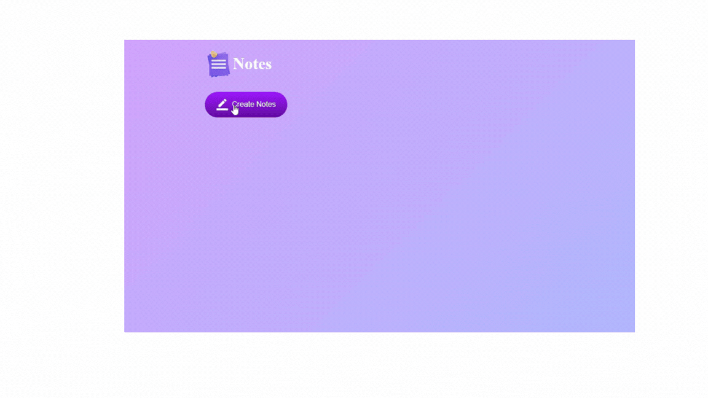

# Notes_App

<h1> <b>📝 Notes App</b> </h1>

<h3>This project is a simple Notes Application designed to help users take notes and prevent forgetting important information. The notes are saved in LocalStorage, so they remain even after refreshing the page. You can also delete your notes once you no longer need them.</h3>

<h1> 🚀 Project Overview </h1>

<h3>During the development of this project, the following technologies were used:</h3>

<h4>
<ul> 
<li><b>HTML 📝: </b> To create the structure of the website.</li>
<li><b>SCSS 🎨: </b> For simple styling and layout.</li>
<li><b>JavaScript ⚡:</b> To make the platform interactive and dynamic.</li>
 </ul> 
 </h4>

 <h1> <b>🔑 Key Features:</b></h1>
  
  <h4>
<ul> 
<li><b> Create and save notes.</b> </li>
<li><b> Notes are stored in LocalStorage, so they persist even after refreshing the page.</b> </li>
<li><b> Delete notes when no longer needed.</b> </li>

 </ul> 
 </h4>

<h4>
<ul> 
<li><b>HTML </b></li>
<li><b>SCSS </b> </li>
<li><b>JavaScript</b></li>
 </ul> 
 </h4>

 <h1> <b> 💻 How to Run the Project </b> </h1>

